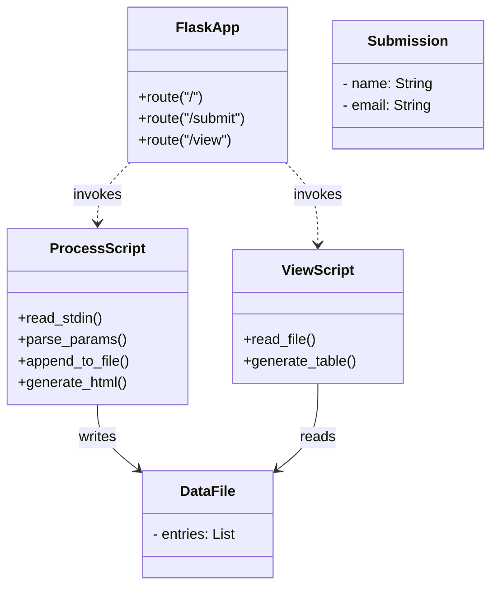

# Flask-Perl Data Submission App

A simple web application that lets users submit their name and email via a web form, processes that data with a Perl script, stores it in a server-side text file, and displays all submissions in a dynamic table.

---

## 🔍 Overview

1. **Form Submission**  
   - Client renders an HTML form at `/`.  
   - On submit, Flask shells out to `scripts/process.pl`.

2. **Data Processing & Storage**  
   - **`scripts/process.pl`**  
     - Reads raw POST body from STDIN  
     - Parses `name=…&email=…`  
     - Appends a line `name,email` to `data.txt`  
     - Emits an HTML “Thank you” response

3. **Viewing Submissions**  
   - **`scripts/view.pl`**  
     - Reads `data.txt`  
     - Generates an HTML table of all stored entries

4. **Flask Wrapper**  
   - **`app.py`**  
     - `/` → renders `templates/index.html`  
     - `/submit` → invokes `process.pl`  
     - `/view`   → invokes `view.pl`  

---

## 📁 Project Structure

```

my\_flask\_app/
├── app.py                 # Flask application
├── data.txt               # CSV storage (writable by server)
├── scripts/
│   ├── process.pl         # Parses & stores submissions
│   └── view\.pl            # Reads & displays submissions
└── templates/
└── index.html         # Jinja2 template: submission form

````

---

## 🚀 Installation & Setup

1. **Clone & enter project**  
   ```bash
   git clone <repo-url> my_flask_app
   cd my_flask_app


2. **Create & activate Python venv**

   ```bash
   python3 -m venv venv
   source venv/bin/activate
   ```

3. **Install dependencies**

   ```bash
   pip install flask
   sudo apt update
   sudo apt install -y perl cpanminus
   # install Perl modules if needed:
   sudo cpanm URI::Escape FindBin
   ```

4. **Prepare files**

   ```bash
   touch data.txt
   chmod 666 data.txt
   chmod +x scripts/process.pl scripts/view.pl
   ```

5. **Run the app**

   ```bash
   export FLASK_APP=app.py
   flask run --host=0.0.0.0 --port=5000
   # or simply:
   python app.py
   ```

6. **Browse**

   * Form: `http://localhost:5000/`
   * View: `http://localhost:5000/view`

---

## 🗂 Data Flow & Storage



* **FlaskApp** invokes **ProcessScript** to handle POSTs and **ViewScript** to render stored data.
* **ProcessScript** writes to **DataFile** (`data.txt`).
* **ViewScript** reads from **DataFile** to display all **Submission** records.

---

## 📖 How It Works

1. User navigates to `/` and sees a styled HTML form.
2. On submit, browser POSTs to `/submit`.
3. Flask runs `scripts/process.pl`, passing form-encoded data on STDIN.
4. `process.pl` parses the input, appends to `data.txt`, and returns a “Thank You” HTML page.
5. User clicks “View All Submissions” → browser GETs `/view`.
6. Flask runs `scripts/view.pl`, which reads `data.txt` and emits an HTML table.

All HTML is generated by the Perl scripts; Flask simply proxies their output.

---

## ⚙️ Notes

* No file locking: simultaneous writes may interleave.
* For production, consider a real database and proper concurrency controls.
* You can extend by adding more form fields—update the Perl parsers and templates accordingly.

## Author
*Rachit Jain 94260

```
```
