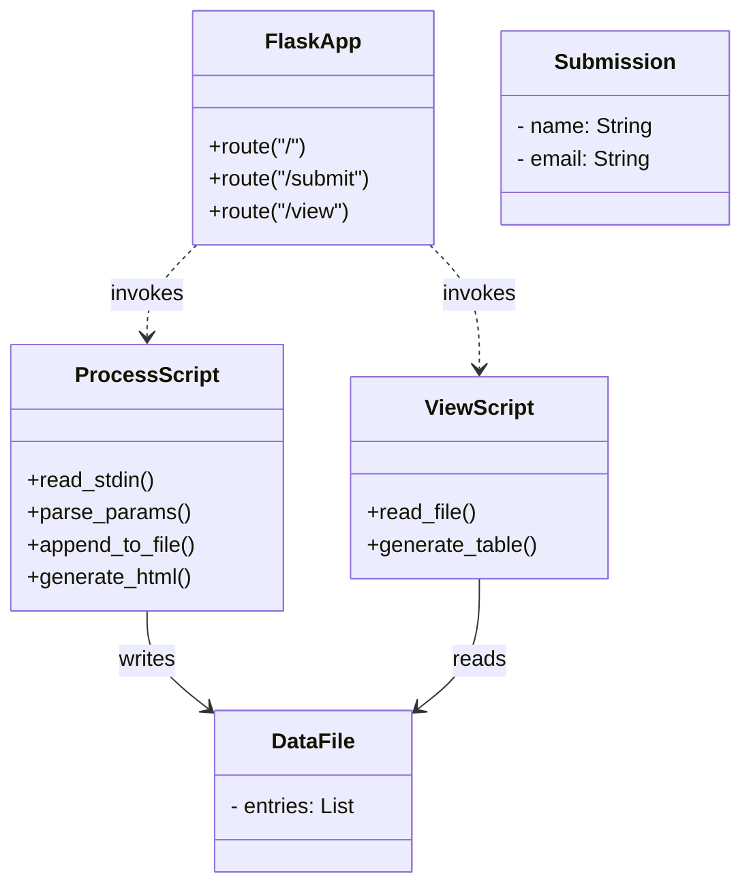

<<<<<<< HEAD
# Flask-Perl Data Submission App

A simple web application that lets users submit their name and email via a web form, processes that data with a Perl script, stores it in a server-side text file, and displays all submissions in a dynamic table.

---

## 🔍 Overview

1. **Form Submission**  
   - Client renders an HTML form at `/`.  
   - On submit, Flask shells out to `scripts/process.pl`.

2. **Data Processing & Storage**  
   - **`scripts/process.pl`**  
     - Reads raw POST body from STDIN  
     - Parses `name=…&email=…`  
     - Appends a line `name,email` to `data.txt`  
     - Emits an HTML “Thank you” response

3. **Viewing Submissions**  
   - **`scripts/view.pl`**  
     - Reads `data.txt`  
     - Generates an HTML table of all stored entries

4. **Flask Wrapper**  
   - **`app.py`**  
     - `/` → renders `templates/index.html`  
     - `/submit` → invokes `process.pl`  
     - `/view`   → invokes `view.pl`  

---

## 📁 Project Structure

```

my\_flask\_app/
├── app.py                 # Flask application
├── data.txt               # CSV storage (writable by server)
├── scripts/
│   ├── process.pl         # Parses & stores submissions
│   └── view\.pl            # Reads & displays submissions
└── templates/
└── index.html         # Jinja2 template: submission form
=======
# Voltage–Current Measurement & Regression Web App

A lightweight Flask application that lets you:

- **Enter measurement pairs** (Voltage in volts, Current in amperes) via a web form  
- **Store** each pair in a server-side text file (`data.txt`)  
- **Display** all readings in a dynamic HTML table  
- **Plot** an interactive scatter plot with best-fit line in the browser (using Chart.js)  
- **Compute** a linear regression (assuming negligible error in Voltage vs. Current error) and show slope/intercept with standard errors

---

## 🗂 Project Structure

```

measurement\_app/
├── app.py                # Flask server & regression logic
├── requirements.txt      # Python dependencies (Flask, NumPy)
├── data.txt              # CSV storage of “voltage,current” lines
└── templates/
├── index.html        # Data entry form (Voltage & Current)
└── results.html      # Table, regression stats & Chart.js plot
>>>>>>> d79a3501164b4e47a1626254edd007f4c1c148fa

````

---

<<<<<<< HEAD
## 🚀 Installation & Setup

1. **Clone & enter project**  
   ```bash
   git clone <repo-url> my_flask_app
   cd my_flask_app


2. **Create & activate Python venv**
=======
## ⚙️ Prerequisites

- Python 3.8+  
- pip (or pipenv/poetry)  
- A modern browser for viewing the Chart.js plot

---

## 📥 Installation

1. **Clone the repo**  
   ```bash
   git clone https://github.com/YOUR_USERNAME/REPO_NAME.git
   cd REPO_NAME


2. **Create & activate a virtual environment**
>>>>>>> d79a3501164b4e47a1626254edd007f4c1c148fa

   ```bash
   python3 -m venv venv
   source venv/bin/activate
   ```

3. **Install dependencies**

   ```bash
<<<<<<< HEAD
   pip install flask
   sudo apt update
   sudo apt install -y perl cpanminus
   # install Perl modules if needed:
   sudo cpanm URI::Escape FindBin
   ```

4. **Prepare files**
=======
   pip install -r requirements.txt
   ```

4. **Prepare the data file**
>>>>>>> d79a3501164b4e47a1626254edd007f4c1c148fa

   ```bash
   touch data.txt
   chmod 666 data.txt
<<<<<<< HEAD
   chmod +x scripts/process.pl scripts/view.pl
   ```

5. **Run the app**

   ```bash
   export FLASK_APP=app.py
   flask run --host=0.0.0.0 --port=5000
   # or simply:
   python app.py
   ```

6. **Browse**

   * Form: `http://localhost:5000/`
   * View: `http://localhost:5000/view`

---

## 🗂 Data Flow & Storage



* **FlaskApp** invokes **ProcessScript** to handle POSTs and **ViewScript** to render stored data.
* **ProcessScript** writes to **DataFile** (`data.txt`).
* **ViewScript** reads from **DataFile** to display all **Submission** records.

---

## 📖 How It Works

1. User navigates to `/` and sees a styled HTML form.
2. On submit, browser POSTs to `/submit`.
3. Flask runs `scripts/process.pl`, passing form-encoded data on STDIN.
4. `process.pl` parses the input, appends to `data.txt`, and returns a “Thank You” HTML page.
5. User clicks “View All Submissions” → browser GETs `/view`.
6. Flask runs `scripts/view.pl`, which reads `data.txt` and emits an HTML table.

All HTML is generated by the Perl scripts; Flask simply proxies their output.

---

## ⚙️ Notes

* No file locking: simultaneous writes may interleave.
* For production, consider a real database and proper concurrency controls.
* You can extend by adding more form fields—update the Perl parsers and templates accordingly.

## Author
- Rachit Jain 94260
=======
   ```

---

## 🚀 Running the App

```bash
# with venv activated
python app.py
```

Open your browser and navigate to:

* **Data Entry** → [http://localhost:5000/](http://localhost:5000/)
* **Results**    → [http://localhost:5000/results](http://localhost:5000/results)

---

## 📝 How It Works

1. **Data Entry (index.html)**

   * User fills in **Voltage (V)** and **Current (A)**.
   * Submits via POST to `/submit`.

2. **Storing the Data (app.py)**

   * The `/submit` route reads `voltage` and `current` from the form.
   * Appends a line `voltage,current` to `data.txt`.
   * Redirects to `/results`.

3. **Reading & Displaying (app.py & results.html)**

   * The `/results` route calls `read_data()`, which:

     * Opens `data.txt`
     * Parses each line into NumPy arrays `Vs` and `Is`
   * Packs raw points into a JSON-serializable list for Chart.js.
   * Renders `results.html` with:

     * An HTML table of all (V,I) readings
     * Regression parameters and errors
     * A `<canvas>` for the chart

4. **Linear Regression & Error Estimation**

   * If **≥ 2** points exist:

     * Calls `np.polyfit(Vs, Is, 1)` to get **slope** (m) and **intercept** (b)

       * Here, *slope* = ΔI/ΔV = 1/R (where R is resistance)
     * If **> 2** points, also calls `polyfit(..., cov=True)` to get covariance → standard errors σₘ, σ\_b
     * This assumes **σᵥ ≪ σᵢ**, so only Current error is significant.

5. **Interactive Plot (Chart.js)**

   * `results.html` includes Chart.js via CDN.
   * JavaScript reads the passed `points` and computes line endpoints from `m` & `b`.
   * Renders a scatter dataset plus a line dataset, with labeled axes.

---

## 🛠 Customization & Extensions

* **Additional fields**: Add new inputs in `index.html` and parse them in `app.py`.
* **Styling**: Modify the embedded CSS in the templates or link your own stylesheet.
* **Data export**: Provide a CSV download link by sending `data.txt`.
* **Authentication**: Wrap routes with Flask-Login or OAuth for user-restricted access.

---

## 👤 Author

Your Name – Rachit Jain (94260)

>>>>>>> d79a3501164b4e47a1626254edd007f4c1c148fa

